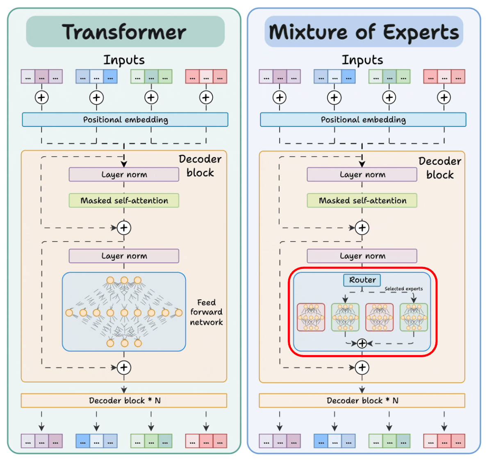
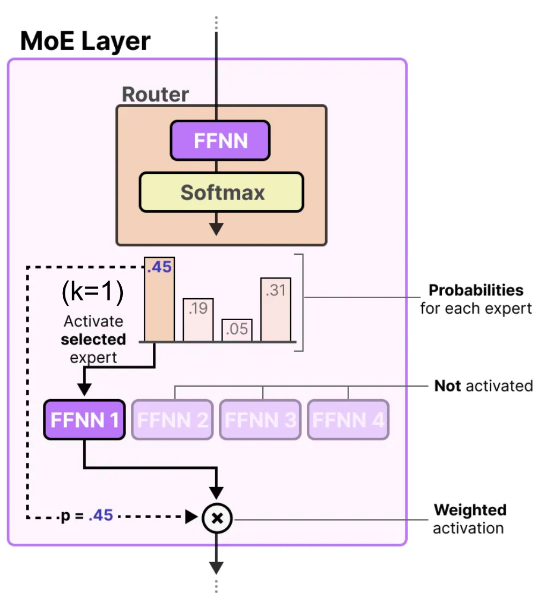
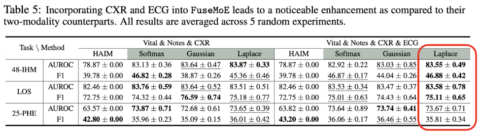

Throwback to a month ago, I did my first Machine Learning subgroup presentation, where I explained about the Mixture-of-Experts (MoE) models and their applications in medicine. 

### What is a MoE?
This blog post will explain MoE in context of Transformers. MoE is a machine learning architecture that combines multiple specialized "expert" models with a "gating network" to dynamically route inputs to the most relevant experts [^1]. It was first introduced in ICLR 2017 by a team in Google Brain [^2]. In a transformer, MoE has two main elements: 
1. They have sparse MoE layers instead of dense feed-forward network (FFN) layers,
2. Router network determines which token is sent to which expert.

See image below to understand the difference between regular versus MoE transformers [^3]. 

#### How does MoE work?
MoE has two main components: router network and experts. Below steps outline how these components interact to  
1. Router network scores the input token against each expert and applies a softmax to produce a probability for every expert: $$h_{soft}(x)_{i} = \text{softmax}(x^T W_i)$$
2. Top-K experts (here, k=1) are activated.
3. Expert’s FFN processes the token and produces an output.
4. Router’s probability for that expert (e.g., 0.45) is used to weigh the expert’s output before passing it onward.

#### Why MoEs are useful, or not
These MoE Transformers are great at dynamic specialization, as each expert focuses on particular patterns or inputs. We have **dynamic gating**, which computes each token and produces probability vector that determines how much "say" each expert gets in the final output. Throughout training, MoE models add an **auxillary loss function** to the regular model loss, which enforces 1) load balancing (penalizes the router if it disproportionately favors a few experts over a batch of tokens) and 2) sparsity (adds an entropy penalty to encourage the router to produce a "spiky" probability distribution). They also have improved model capacity as they are able to process high number parameters without comparable costs. Unlike normal transformers where each feed-forward network (FFN) computes all parameters, MoE router selects the $K$ experts with the highest probabilities (the Top-K) and only those $K$ experts are computed. The other $N-K$ experts are not activated and consume zero computational power.

However, MoEs still have a few downsides, with one of them being that they may suffer from irregular and missing data. Let's consider an example where the input data question is: "What is 1+1?". Now, let's assume we are missing the numerical part of the data, and all we are left is "What is ?". Then, router still computes scores for all experts with zero-filled embeddings for numbers. This can lead to the router incorrectly sending the incomplete math equation to "verb" expert (for example) instead of "number" expert (again, for example). If many incomplete math questions (input data) arrive, then the "word" expert would get overloaded while "number" experts get underused, meaning that the final answer will be computed by the wrong experts. Overall, this can lead to lower predication accuracy.

There have been many variations of MoE to combat its limitations towards missing data. One prominent example is FuseMoE, published in NeurIPS 2024 by Han et al. at Johns Hopkins [^4]. FuseMoE argues that it can deal with "FlexiModal Data," where "Flexi" suggests flexibility with any combination of modalities even with arbitrary missingness or irregularity. 

#### FuseMoE: Router Structure

FuseMoE follows closely to the original MoE framework. In the image above, (a) utilizes joint experts and router. This is the structure of a typical MoE, which utilizes concatenated embedding of all modalities. It combines all theinput to selected experts as processed by the router. (c) employs disjoint experts, where each modality has separate router and dedicated experts. While disjoint experts solve the main issue of the regular MoE in that there is no misrouting, this method also does not allow for cross-modal feature learning, which can stagger the learning process for the model. (b)'s per-modality router structure explains FuseMoE's mechanism. In FuseMoE, each modality embedding is independently assigned to a shared pool of experts. This is better than (a) since it avoids blind misrouting -- each router only sees the embeddings for its modality, so it never confuses token as another modality. Each modality's router in (a) also tailors its routing weights to the statistics of that modality's embeddings. At the same time, (b) is also better than (c) since it preserves cross-modal sharing, which allows for shared represnetations and transfer knowledge. In essence, FuseMoE modifies its structure so that routers are specialized but experts remain shared. 

#### FuseMoE: Laplace Gating Function
FuseMoE uses Laplace gating function to pick experts based on how "close" each expert is to the input. 

Specifically, their routing function is: $$h_\ell(x)_i = -\|x - W_i\|_2^2$$, with gate probabilities of $$G_\ell(x)_i = \frac{\exp(h_\ell(x)_i)}{\sum_{j=1}^S \exp(h_\ell(x)_j)}$$.

This gating function produces smoother gradients since the gradient is $$2(x-w)$$, meaning that it is always proportional to the difference. It can also handle different scales, as the model adjusts to extreme modality values by measuring absolute values. 

#### FuseMoE: Entropy Regularization Loss
FuseMoE also utilizes entropy regularization loss, which is $$\mathcal{E}(x) = \frac{1}{M} \sum_{j=1}^M \mathcal{H}(\hat{p}_{m_j}(E)) - \mathcal{H}\left(\frac{1}{M} \sum_{j=1}^M \hat{p}_{m_j}(E)\right)$$, where:
- $$x$$: input token's representation,
- $$M$$: the number of different modality conditions
- $$\hat{p}_{m_j}(E)$$: vector of routing weights that router $j$ assigns to each expert $E$
- $$\mathcal{H}$$ : entropy function

This ensures per-modality specialization and cross-modal consensus. The first term is the average entropy of each modality's router output. If the value of first term is high, each modality's router spreads braodly over experts. The second term is the entropy of the mixture distribution after averaging M number of modality-conditioned router outputs. If the second term is high, combined distribution is flat. 

#### FuseMoE: Application to MIMIC-IV
The team carried out an experiment to perform 48-hour in-hospital mortality prediction (48-IHM), length-of-stay prediction (LOS), and 25-type phenotype classification (25-PHE) using MIMIC-IV dataset. 

From Table 4 (below), we can see that the best results, which are highlighted in bold font, largely come from FuSeMoE-based methods with various gating function. 

The team also compares Fuse-MoE's efficacy with increasing number of modalities. As the model is provided with ECG, in addition to Vital, Notes, and CXR, we can see that FuseMoE with Laplace gating function performs better than other models.

#### FuseMoE: Limitations and Conclusions
While FuseMoE allows for per-modality specialization and cross-modal conesnsus, it has some limitations as well. First, FuseMoE's modality combination is predefined. This means that adpating to new modalities requires architectural changes and retraining. Moreover, while per-modality encoders are pretrained, the MoE fusion layer still needs substantial in-domain data to fine-tune effectively. Therefore, small clinical cohorts risk under-trained experts and overfitting. 

Regardless, FuseMoE introduces a flexible, scalable Mixture-of-Experts layer for transformers that natively handles any combination of modalities. Specifically, per-modality routers over a shared expert pool modality learns specialized routes without losing cross-modal transfer. Laplace gating function yields smoother, bounded gradients and faster, uniform convergence guarantees for both router and expert parameters. Lastly, entropy regularizer encourages each modality’s router to explore multiple experts while driving all routers toward consensus on a small core of experts.

#### Wrapping up...
I came across FuseMoE as I was reading methodology papers that present multimodal AI models. FuseMoE could be a very useful model when trying to build a risk prediction model for cardiovascular disease given multimodal clinical data, where missing data is especially common. However, it might be challenging to adopt FuseMoE in real clinical settings since it will be rare for a dataset to be as large as MIMIC-IV. 

[^1]: IBM. (n.d.). *What is a mixture of experts (MoE)?* IBM Think. Retrieved October 25, 2025, from https://www.ibm.com/think/topics/mixture-of-experts
[^2]: Shazeer, N., Mirhoseini, A., Maziarz, K., Davis, A., Le, Q., Hinton, G., & Dean, J. (2017, February 6). Outrageously Large Neural Networks: The Sparsely-Gated Mixture-of-Experts Layer. International Conference on Learning Representations (ICLR). Retrieved October 25, 2025, from https://openreview.net/forum?id=B1ckMDqlg
[^3]: Chawla, A. (2025, February 27). Transformer vs. Mixture of Experts in LLMs. Daily Dose of Data Science. Retrieved October 25, 2025, from https://www.dailydoseofds.com/p/transformer-vs-mixture-of-experts-in-llms/
[^4]: Han, X., Nguyen, H., Harris, C., Ho, N., & Saria, S. (2024). FuseMoE: Mixture-of-Experts Transformers for Fleximodal Fusion. Advances in Neural Information Processing Systems 37 (NeurIPS 2024). Retrieved October 25, 2025, from https://proceedings.neurips.cc/paper_files/paper/2024/hash/7d62a85ebfed2f680eb5544beae93191-Abstract-Conference.html